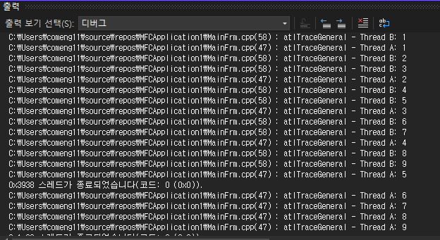

# 231030

20191276 컴퓨터공학과 양용석

간단한 멀티태스킹 예제 (출력 창에서 스레드 두개가 일정 주기마다 카운트하는 예제)

코드 

```
//CMainFrm.cpp 파일에서 전역함수 ThreadFunctionA, B 선언

UINT ThreadFunctionA(LPVOID pParam);
UINT ThreadFunctionB(LPVOID pParam);

//A : 1부터 10까지 1초 간격으로 카운트 
UINT ThreadFunctionA(LPVOID pParam)
{
	for (int i = 0; i < 10; ++i)
	{
		TRACE("Thread A: %d\n", i);
		Sleep(1000); // 1초 동안 잠깁니다.
	}

	return 0;
}
//B 정의 : 1부터 10까지 0.5초 간격으로 카운트
UINT ThreadFunctionB(LPVOID pParam)
{
	for (int i = 0; i < 10; ++i)
	{
		TRACE("Thread B: %d\n", i);
		Sleep(500); // 0.5초 동안 잠깁니다.
	}

	return 0;
}
//OnCreate() 내부에 두 함수가 병렬로 실행되도록 스레드를 생성
  AfxBeginThread(ThreadFunctionA, NULL);
	AfxBeginThread(ThreadFunctionB, NULL);

```
실행 결과 </br>
 </br>
</br>
위와 같이 ThreadFunctionA 함수에서는 1초마다 숫자를 출력하고, ThreadFunctionB 함수에서는 0.5초마다 숫자를 출력합니다.</br>
이 두 함수가 별도의 스레드에서 실행되므로, 한 함수가 대기 상태에 있어도 다른 함수가 계속해서 실행됩니다.</br>
예를 들어, ThreadFunctionA가 1초 동안 잠자고 있는 동안에도 ThreadFunctionB는 계속해서 실행되어 숫자를 출력합니다.</br>
따라서 출력 창에 출력된 메시지들은 두 스레드가 번갈아 가면서 진행되고 있다는 것을 보여줍니다.</br>
